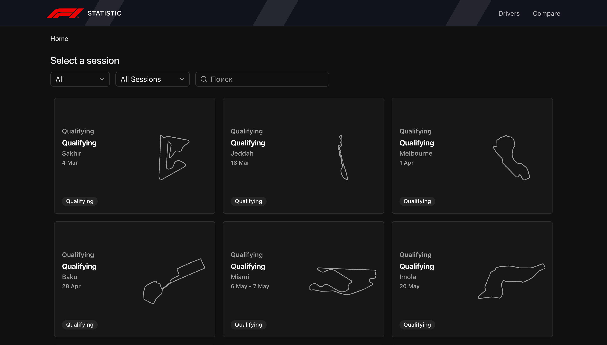
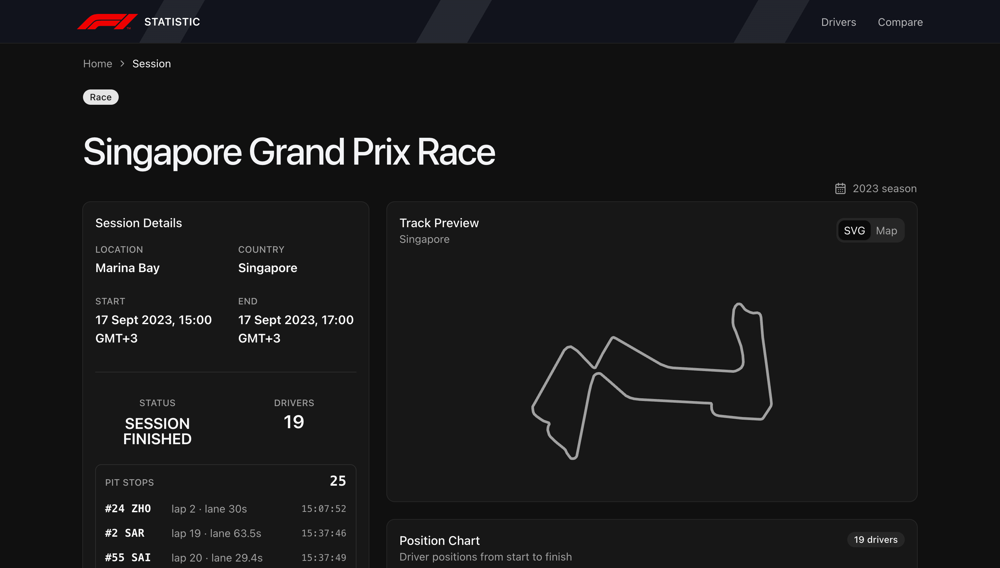
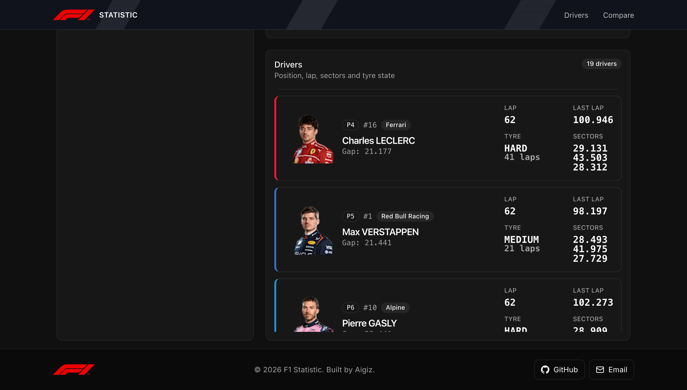
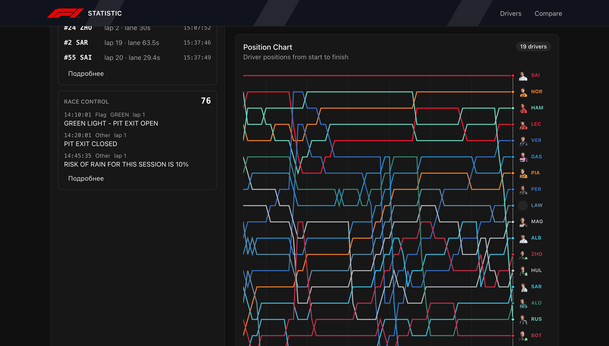

# F1 Statistic

F1 Statistic помогает исследовать гоночные сессии Формулы-1.

Приложение объединяет информацию о заездах, пилотах, трассах, пит-стопах и изменении позиций в одном интерфейсе.

Пользователь может найти нужную сессию, изучить состав участников и проследить, как менялся порядок пилотов по ходу гонки.

<!-- Скриншот: список и фильтры гоночных сессий -->



## Какую проблему решает проект

Данные Формулы-1 часто приходится собирать из разных мест: отдельно искать сессию, пилотов, позиции, время, трассу и события гонки.

F1 Statistic объединяет эти данные в одном сценарии. Пользователь видит, где и когда проходила сессия, кто в ней участвовал и как менялась расстановка пилотов на дистанции.

Вместо работы с разрозненными ответами API пользователь получает готовую картину заезда: участников, события и изменение позиций во времени.

## Основные возможности

### Поиск и выбор сессий

На главной странице доступен список гоночных сессий с фильтрами по сезону и типу.

Поиск работает по названию сессии, короткому названию трассы и локации. Совпадения подсвечиваются прямо в карточках.

Список построен через виртуализацию, поэтому интерфейс остаётся отзывчивым при большом количестве карточек.

### Информация о выбранном заезде

Отдельная страница сессии показывает тип заезда, сезон, локацию, страну, время начала и окончания, статус сессии и количество пилотов.

На этой же странице доступны пит-стопы и сообщения гоночного контроля (race control).

<!-- Скриншот: страница выбранной сессии -->



### Пилоты и трасса

Пользователь видит список участников с позициями, номерами, командами, отставанием, текущим кругом, последним кругом, секторами и состоянием шин.

Список пилотов также виртуализирован. Трасса отображается двумя способами: как SVG-превью по локальным GeoJSON-данным и как карта Leaflet с подложкой OpenStreetMap.

<!-- Скриншот: информация о трассе и участниках -->



### Анализ позиций

График показывает, как менялись позиции пилотов от старта к финишу.

Линии строятся по реальным временным точкам, окрашиваются цветами команд и связываются с данными пилотов. Ось позиций развернута так, чтобы первое место находилось сверху.

Интерактивная подсказка помогает сравнить порядок пилотов в выбранный момент времени.

<!-- Скриншот: график изменения позиций пилотов -->



### Удобство интерфейса

В приложении есть единый layout с навигацией, хлебными крошками и тёмной визуальной темой.

Интерфейс корректно обрабатывает загрузку, отсутствие данных и сетевые ошибки. Сетка списка сессий адаптируется под ширину экрана.

## Основной сценарий

1. Пользователь выбирает сезон и тип сессии.
2. Находит нужный заезд через поиск и карточки с трассами.
3. Открывает страницу выбранной сессии.
4. Просматривает информацию о месте, времени, статусе сессии, пилотах и трассе.
5. Анализирует изменение позиций на графике и сопоставляет его с участниками заезда.

## Технологии

### Frontend

- `React 19` и `TypeScript` используются для интерфейса и строгой типизации.
- `Vite` отвечает за dev-сервер и production-сборку.
- `React Router` управляет маршрутами главной страницы и страницы сессии.
- `TanStack Query` загружает, кэширует и переиспользует серверные данные.
- `Recharts` строит график изменения позиций пилотов.
- `Tailwind CSS` и `shadcn/ui` дают стили, дизайн-токены и переиспользуемые UI-компоненты.
- `d3-geo`, `Leaflet`, `react-leaflet` используются для визуализации трасс.
- `react-virtuoso` отвечает за виртуализированные списки сессий и пилотов.

Для качества кода используются `oxlint`, `Prettier`, `Husky` и `lint-staged`.

### Работа с API

Frontend получает данные через отдельный backend API.

Адрес API задаётся через переменную окружения `VITE_API_BASE_URL`.

Запросы и TypeScript-типы генерируются по OpenAPI-спецификации.

Общий клиент на `axios` отвечает за повторные запросы и обработку сетевых ошибок.

Серверные данные загружаются и кэшируются через `TanStack Query`.

## Архитектура и работа с данными

Проект организован по Feature-Sliced Design.

Маршрутизация и провайдеры находятся в `app`. Страницы лежат в `pages`, крупные блоки интерфейса в `widgets`, бизнес-сущности в `entities`, а общий API-слой, UI-kit и утилиты в `shared`.

Данные dashboard и позиции сессии загружаются независимыми query-хуками.

Перед построением графика временные точки сортируются и объединяются в 30-секундные интервалы.

Для каждого пилота формируется отдельная серия, а пропущенные значения заполняются последней известной позицией. Благодаря этому график показывает непрерывное изменение порядка участников по ходу сессии.

Серии графика используют номера, имена и цвета команд пилотов.

## Запуск проекта

Создайте файл `.env` по примеру `env.example` и укажите адрес backend API:

```env
VITE_API_BASE_URL="http://localhost:3000"
```

Установка зависимостей и запуск dev-сервера:

```bash
npm install
npm run dev
```

Production-сборка:

```bash
npm run build
```

Общая проверка проекта:

```bash
npm run check
```

Команда `npm run check` запускает проверку типов, `oxlint` и проверку форматирования.

## Структура репозитория

```text
src/
├── app/       # провайдеры, layout и маршрутизация
├── pages/     # страницы списка сессий, сессии и пилота
├── widgets/   # header, footer и глобальные alert-уведомления
├── features/  # отдельные пользовательские действия
├── entities/  # сессии, пилоты, трассы и их API/model/ui
└── shared/    # API-клиент, сгенерированные типы, UI-kit, утилиты и ассеты
```
